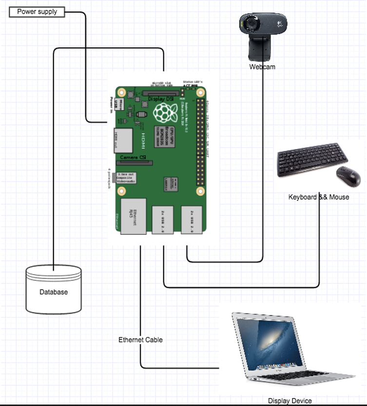
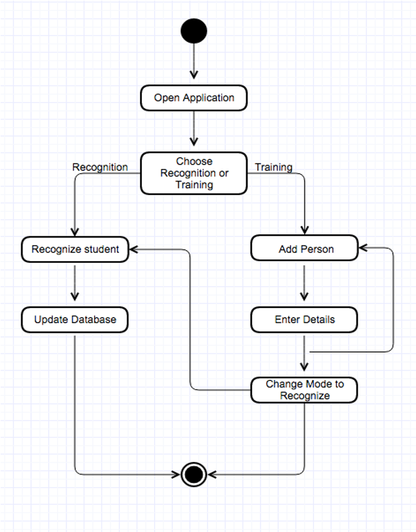
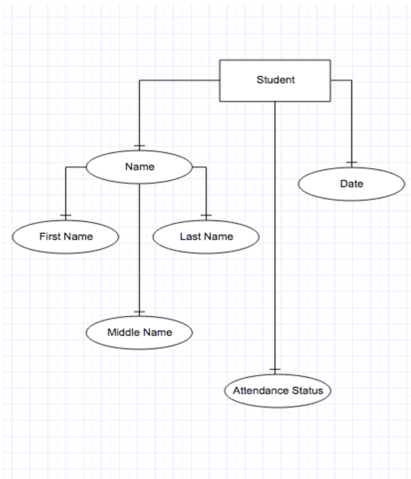

# Automated Attendance System

## Objective:
To create a an automated system that eliminates the manual process of attendance management.

## System Components:
1. Raspberry Pi
2. CLI Application
3. MySQL Database
4. Email client

Architecture of The Project

 

Activity_Diagram

 

ER_Model

 

